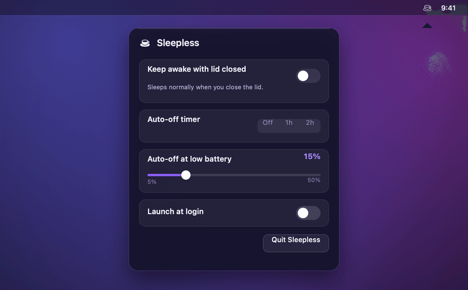

<!-- Language switcher. Keep this row identical across every README.<lang>.md. -->
<p align="center">
  <a href="README.md">English</a> &nbsp;·&nbsp;
  <a href="README.zh-CN.md">简体中文</a> &nbsp;·&nbsp;
  <a href="README.es.md">Español</a> &nbsp;·&nbsp;
  <a href="README.ja.md">日本語</a> &nbsp;·&nbsp;
  <a href="README.fr.md">Français</a> &nbsp;·&nbsp;
  <b>Deutsch</b>
</p>

> Diese Übersetzung wurde von der Community bzw. maschinell erstellt und kann gegenüber dem englischen README veraltet sein. Maßgeblich ist die englische Version. Siehe [English README](README.md).

<p align="center">
  <picture>
    <source media="(prefers-color-scheme: dark)" srcset="assets/hero-dark.gif">
    <source media="(prefers-color-scheme: light)" srcset="assets/hero-light.gif">
    
  </picture>
</p>

<p align="center">
  <b>Sleepless hält dein MacBook bei geschlossenem Deckel wach, im Akkubetrieb, ohne externen Bildschirm.</b><br>
  <sub>Ein nativer Schalter in der Menüleiste, mit automatischer Abschaltung bei einem von dir gewählten Akkustand, damit du ihn nie ganz leerziehst.</sub>
</p>

<p align="center">
  <a href="https://github.com/Aboudjem/Sleepless/actions/workflows/ci.yml"></a>
  <a href="https://github.com/Aboudjem/Sleepless/releases/latest"></a>
  <a href="https://github.com/Aboudjem/Sleepless/releases"></a>
  <a href="LICENSE"></a>
  
  <a href="https://github.com/Aboudjem/Sleepless/stargazers"></a>
</p>

<p align="center">
  
</p>

> [!NOTE]
> Wenn du den Deckel schließt, geht dein Mac normalerweise in den Ruhezustand, und Apps auf `caffeinate`-Basis (KeepingYouAwake und Co.) **können** das nicht ändern. Sleepless legt die eine Einstellung um, die es kann, `pmset disablesleep`, und sichert sie dann mit einer automatischen Abschaltung bei einem Akku-Mindeststand ab, sodass du sie bedenkenlos vergessen kannst.

## Was du bekommst

|  |  |
|---|---|
| 🌙 **Ein Schalter** | Klicke auf den Mond in der Menüleiste und lege den Schalter um. Das Symbol zeigt den Zustand auf einen Blick. |
| 🔋 **Automatische Abschaltung bei Akku-Mindeststand** | Wähle einen Mindeststand (5–50 %, Standard 15 %). Im Akkubetrieb schaltet es sich selbst ab, bevor du den Akku leerziehst. |
| 🖥️ **Kein Bildschirm, kein Dongle** | Nur der Deckel geschlossen, im Akkubetrieb. Kein externer Monitor, kein HDMI-Dummy-Stecker. |
| 🪶 **Winzig und nativ** | AppKit + SF Symbols. Kein Dock-Symbol, kein Hintergrund-Daemon, keine kext, keine Abhängigkeiten. |

## Installation

**Homebrew** (empfohlen):

```sh
brew install --cask aboudjem/tap/sleepless
# one-time: add the passwordless grant (it prints exactly what it writes first)
/Applications/Sleepless.app/Contents/Resources/grant.sh
```

**Aus dem Quellcode bauen** (der Vertrauenspfad: lies ihn, bau ihn, kein Gatekeeper-Hinweis):

```sh
git clone https://github.com/Aboudjem/Sleepless.git
cd Sleepless && ./install.sh
```

**Oder lade die App herunter:** Hol dir das [latest release](https://github.com/Aboudjem/Sleepless/releases/latest), entpacke es und verschiebe `Sleepless.app` nach `/Applications`. Sie ist ad-hoc signiert, also bestätige den ersten Start unter **Systemeinstellungen → Datenschutz & Sicherheit → Trotzdem öffnen** (der alte Trick mit Rechtsklick → Öffnen wurde in macOS 15 entfernt).

Klicke dann auf den Mond, lege den Schalter um und schließe den Deckel. `./uninstall.sh` entfernt alles und belegt, dass die Berechtigung weg ist.

## So funktioniert es

`caffeinate` und die dabei genutzten Power Assertions können den Hardware-Trigger beim Schließen des Deckels nicht überstimmen, daher schickt ein geschlossener Deckel den Mac immer in den Ruhezustand. Die eine Systemeinstellung, die das überstimmt, ist `pmset disablesleep`. Sleepless schaltet sie über einen nativen Schalter um, liest den Live-Wert zurück, sodass die Oberfläche nie lügt, und setzt sie bei deinem Akku-Mindeststand automatisch zurück. Ein Neustart setzt sie ebenfalls zurück. [Vollständiges Sicherheitsmodell →](SECURITY.md)

## Sleepless im Vergleich zu den Alternativen

| | **Sleepless** | Amphetamine | KeepingYouAwake | Macchiato | Clapet | `caffeinate` |
|---|:---:|:---:|:---:|:---:|:---:|:---:|
| Wach, Deckel geschlossen, im Akkubetrieb | ✅ | ✅¹ | ❌ | ✅ | ⚠️ ext. Display | ❌ |
| Kein externer Bildschirm nötig | ✅ | ✅ | n/v | ✅ | ❌ | n/v |
| Automatische Abschaltung bei Akku-Mindeststand | ✅ | nur bei niedrigem Akku | ✅² | ❌ | ❌ | ❌ |
| Open Source | ✅ MIT | ❌ App Store | ✅ MIT | ✅ Apache | ✅ GPL | Apple |

<sub>¹ Amphetamine kann es, setzt aber auf Apple Silicon auf ein separates "Power Protect"-Skript und bricht Berichten zufolge häufig bei Strom- bzw. Dock-Wechseln ab. &nbsp; ² KeepingYouAwake hat eine Akku-Abschaltung, kann aber konzeptbedingt bei geschlossenem Deckel nicht wach bleiben. Sternzahlen (≈6,6k / ≈18 / ≈101) abgerufen am 2026-06-01; Korrekturen willkommen.</sub>

## Setze es ein, um…

- 🤖 **Einen langen Job zu Ende zu bringen, nachdem du weggegangen bist.** Ein Lauf eines KI-Agenten, ein Build, ein Render, ML-Training, eine große `brew`/`npm`-Installation: schalte es ein, schließe den Deckel, steck es in die Tasche, komm zu einem fertigen Job zurück.
- 📡 **Deinen Hotspot unterwegs zu teilen.** Internetfreigabe / Persönlicher Hotspot vom Mac läuft auch bei geschlossenem Deckel weiter.
- ⬇️ **Große Übertragungen laufen zu lassen.** Große Downloads, Uploads oder ein Time-Machine-Backup laufen fertig, während du kurz weg bist.
- 🖥️ **Einen Server oder eine SSH-Sitzung am Leben zu halten.** Ein lokaler Dev-Server, ein Sync-Daemon oder eine entfernte Sitzung bleibt erreichbar, Deckel geschlossen.
- 🎧 **Audio weiterlaufen zu lassen.** Musik oder ein langes Render spielt in der Tasche weiter.

> [!TIP]
> Setze den Akku-Mindeststand auf einen Wert, dem du vertraust (etwa 20 %), und du kannst all das machen, ohne den Akku im Auge behalten zu müssen.

## Ist es sicher?

Ja, und es ist auf Überprüfbarkeit ausgelegt. Eine GUI-App kann kein Passwort eintippen, daher fügt das Installationsprogramm eine eng gefasste `/etc/sudoers.d`-Regel hinzu (root-eigen, `0440`), die **genau zwei Befehle und sonst nichts** erlaubt:

```
<you> ALL=(root) NOPASSWD: /usr/bin/pmset -a disablesleep 0, /usr/bin/pmset -a disablesleep 1
```

- **Sie lässt sich nicht ausweiten.** `sudoers` gleicht Argumente wörtlich ab, ohne Platzhalter, sodass jeder andere Befehl wieder nach einem Passwort fragt.
- **Kein Daemon, kein Hilfsskript**, das ein Angreifer kapern könnte. Es ruft Apples `/usr/bin/pmset` direkt mit einem argv-Array auf (keine Shell).
- **Immer reversibel.** Ein Neustart setzt das Flag zurück, der Akku-Mindeststand schaltet es ab, und `./uninstall.sh` entfernt die Berechtigung und belegt es.

Das vollständige Bedrohungsmodell, die undokumentierten, aber realen Belege für `disablesleep` und der Kompromiss bei der Notarisierung stehen in **[SECURITY.md](SECURITY.md)**.

## FAQ

<details>
<summary><b>Funktioniert es wirklich bei geschlossenem Deckel, im Akkubetrieb, ohne Bildschirm?</b></summary>

Ja, das ist der ganze Sinn. Verifiziert auf macOS 26 (Tahoe) / Apple Silicon.
</details>

<details>
<summary><b>Der Mond erscheint nicht in meiner Menüleiste.</b></summary>

macOS 26 kann Elemente der Menüleiste ausblenden. Prüfe die Systemeinstellungen (Kontrollzentrum / Menüleiste) und erlaube Sleepless, sein Element anzuzeigen. Bestätige mit <code>pgrep -x Sleepless</code>, dass es läuft.
</details>

<details>
<summary><b>Warum ist es nicht notarisiert?</b></summary>

Es ist ein persönliches, quelloffenes Werkzeug ohne bezahlte Apple Developer ID, also ist es ad-hoc signiert. Baue es aus dem Quellcode, um Gatekeeper ganz zu umgehen, oder nutze den <b>Trotzdem öffnen</b>-Ablauf für die vorgefertigte App.
</details>

<details>
<summary><b>Zieht es meinen Akku leer?</b></summary>

Nur wenn du den Mindeststand ignorierst. Während es wach ist und entlädt, schaltet es bei dem von dir gesetzten Prozentsatz ab (Standard 15 %), und ein Neustart stellt immer den normalen Ruhezustand wieder her.
</details>

<details>
<summary><b>Funktioniert es auf Intel oder älterem macOS?</b></summary>

Es ist auf <b>macOS 26 Apple Silicon</b> verifiziert. <code>disablesleep</code> ist undokumentiert, daher sind andere Versionen oder Hardware nicht garantiert. Probier es aus und melde dich zurück, ehrliche Berichte sind willkommen.
</details>

## Mitwirken

Issues und PRs sind willkommen, besonders Übersetzungen und Testberichte von anderer Hardware. Siehe [CONTRIBUTING.md](CONTRIBUTING.md) und den [Code of Conduct](CODE_OF_CONDUCT.md). Sleepless bleibt bewusst klein.

## Lizenz

[MIT](LICENSE) © 2026 Adam Boudjemaa.

<p align="center">
  <sub>Wenn Sleepless dir einen Ausflug ins Terminal erspart hat, hilft ein ⭐ anderen, es zu finden.</sub>
</p>
